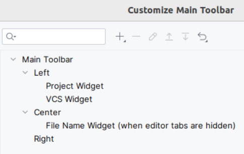
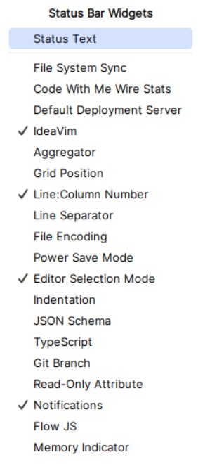

# JetBrains Settings

1. [Appearance](#appearance)
2. [Customize Toolbar](#customize-toolbar)
3. [Plugins](#plugins)
4. [Keymap](#keymap)

## Appearance

- use smaller indents in trees (on)
- New UI: compact mode
- view:
  - compact mode
  - status bar
- tab placement: none
- remember size for each tool window

## Customize Toolbar

- remove everything in Right
- remove everything in Left, exclude *Project Widget* and *VCS Widget*

## Editors

- General: Appearance : Show indent (off)

## Status Bar

## Plugins

- IdeaVim

## Keymap

Alt+B | Grade and Maven
